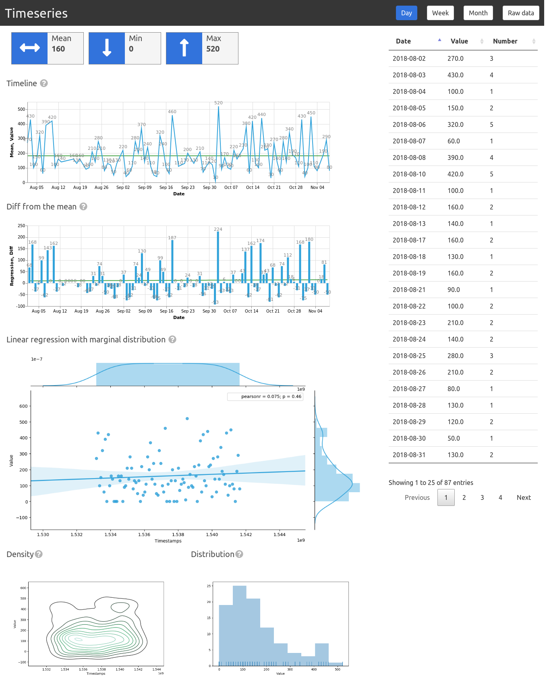

# Django Chartflo

Charts for the lazy ones in Django. Compose dashboards using pre-generated html charts. Available widgets:

   - Number
   - Sparkline
   - Datatable

Check the [documentation](http://django-chartflo.readthedocs.io/en/latest/index.html) for the install and usage
instructions

Optionaly powered by the [Dataswim](https://github.com/synw/dataswim) data analytics library for charts generation

### Screenshot

